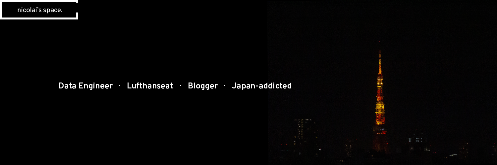

# Hi, I'm Nicolai ✌️ 👨‍💻

I'm a Data Engineer working for Deutsche Lufthansa, who is passionate about making open-source more accessible. Some technologies I enjoy working with are Kubernetes, Prometheus and Kong API Gateway, as well as Python, Java and Swift. I'm also interested in DevOps, Japanese kitchen and sports.

## Get Connected

